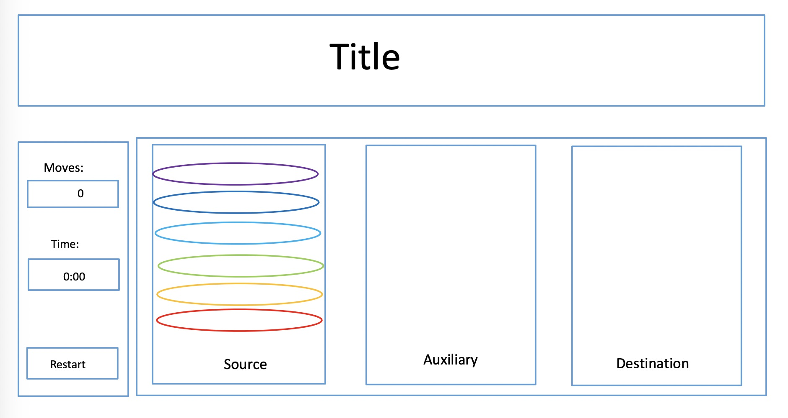

# GA- Project 1:  Tower of Hanoi

## Installation:
No need.

## Links:
- Wireframe:

 - [Link to Tower of Hanoi Game](https://dvorakkarrie.github.io/)

 ## Preview:
 The above link will direct you to a Tower of Hanoi game with counters to track the time and number of moves required to complete the game after selecting the desired number of disks.

 ## Technology Used:
- Animate.css:  Added animation to the disks and winning message
- CodePen: Reviewed other game javascript code
- Command Line:  Navigated files and interacted with GitHub
- Google Chrome:  Developer Tools used to debug and review code and tested the application via the browser
- OneNote:  Built wireframe
- Visual Studio Code:  HTML, CSS & Javascript coding

## Approach:
The main approach for this game was to track the number of moves and time used as the user successfully moved the disks from the left hand tower to the right hand tower. An array was used with a for loop to create the disks.  Conditional statements were used to display the time, select/move the disks and determine when the user won the game.

## Main features:
- Number of disk dropdown list
- Move and time counters
- Restart button
- Animation added

## User Stories:
- As a user, I should be able to view the instructions before and while I play the game.
- As a user, I should be able to select the desired number of disks before I play the game.
- As a user, I should be able to restart the game after selecting the level and after the game ends.
- As a user, I should be able to select a top most disk from one tower and move it to another tower.
- As a user, I should see an error message if I select a tower before I have selected a disk to move.
- As a user, I should not be able to place a larger disk on a smaller disk.
- As a user, I should be shown an error message if I try to place a larger disk on a smaller one.
- As a user, I should see a message that I won when I move all the disks to the right hand tower.
- As a user, I should see a message to restart the game after the user wins.

## Unsolved Problems
- The user has a limited amount of space to click when moving the selected disk from one tower to another.

## Future Plans
- Apply draggable feature to the disks.
- Develop a process to store the user's time, moves and number of wins.
- Add a automated solve feature to show the user the ideal moves.